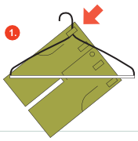
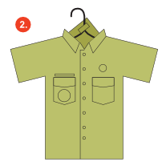
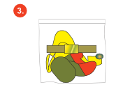
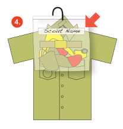

We check-in uniforms before summer camp to ensure that everyone has a complete uniform. If you do not have a pieco of the uniform, They should be able to give you it at the check-in meeting. To prepare your uniform, follow the instructions below:

1. Hang your troop T-shirt on the hanger.
2. Hang your troop sweatshirt over the T-shirt
3. Remove your belt from your shorts. Hang your shorts on the back of your hanger. One of the belt loops should be going through the hook. Note: the images below do not show the T-shirt or sweatshirt.
4. Hang your BSA shirt over everything else, and button it all the way up.
5. Write T-150 and your name+last name on a one gallon bag.
6. Put your neckerchief, slide, belt, and socks in your one gallon bag. You will probably want more than one pair of socks.
7. Poke a hole through the bag at the top, and slide it on to your hook. The hole will last longer if you put tape on either side of the bag and poke the hole through that.
8. Hang your hat on the hook, and make sure your name is on your hat somewhere.